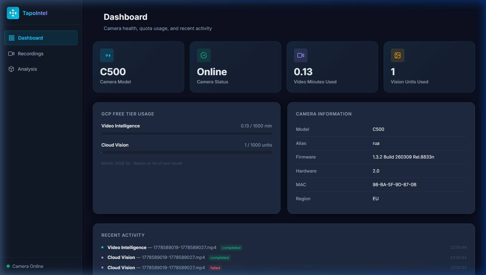
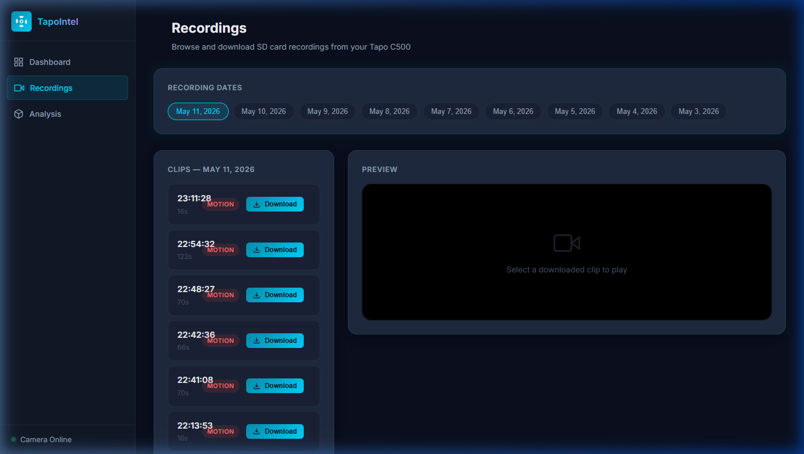
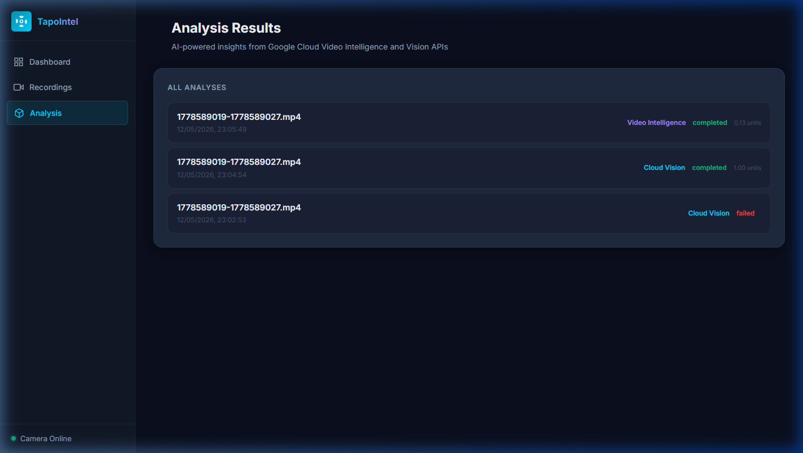

# TapoIntel

> Automated SD card recording retrieval and AI-powered video analysis for Tapo C500 cameras

[](https://www.python.org/)
[](https://fastapi.tiangolo.com/)
[](https://www.docker.com/)
[](https://cloud.google.com/)
[](LICENSE)



TapoIntel is a self-hosted, dockerized application that bridges your **Tapo C500 IP camera** with **Google Cloud AI services**. It retrieves motion-triggered recordings directly from the camera's SD card, assembles them into playable `.mp4` files, and analyzes them with the **Video Intelligence API** (label detection, object tracking, shot changes) and **Cloud Vision API** (keyframe scene classification).

Everything runs within Google Cloud's **free tier** — 1,000 minutes/month for Video Intelligence and 1,000 units/month for Vision — with built-in quota tracking to keep you safe.

---

## Features

- 📹 **SD card access** — lists and downloads recordings directly from the Tapo C500 using the proprietary Tapo protocol (port 8800), bypassing the need for cloud storage
- ⬇️ **Streaming downloads** — real-time progress via Server-Sent Events; FFmpeg assembles encrypted `.ts` streams into standard `.mp4`
- 🤖 **Video Intelligence API** — label detection, object tracking, and shot-change detection on every downloaded clip
- 👁️ **Cloud Vision API** — keyframe extraction + label and object localization on a representative still frame
- 📊 **Free tier quota tracking** — monthly usage counters per service, with guard rails to prevent overage
- 🖥️ **Web dashboard** — dark-themed SPA with live camera status, quota gauges, clip browser, video player, and analysis results
- 🐳 **Multi-platform Docker** — single image targets `linux/amd64`, `linux/arm64`, and `linux/arm/v7` (armhf), runs on x86 servers, Raspberry Pi, and Orange Pi boards
- 🔒 **Credential safety** — all secrets in `.env`, never hardcoded; `credentials/` and `data/` are gitignored

---

## Screenshots

### Dashboard

Camera model, status, GCP quota gauges, firmware info, and recent activity feed.


### Recordings

Browse recording dates from the SD card, list motion clips with duration and type badges, download with live progress, and preview in-browser.



### Analysis Results

AI analysis history with job status, units consumed, and timestamps. Click any row to expand detected labels, tracked objects, and shot boundaries.



---

## Architecture

```
┌──────────────────────────────────────────────────────────┐
│  Browser  →  http://localhost:8000                       │
│                                                          │
│  ┌─────────────────────────────────────────────────────┐ │
│  │  FastAPI backend (Python 3.11 + FFmpeg)             │ │
│  │                                                     │ │
│  │  /api/recordings/*   Tapo SD card (port 8800)       │ │
│  │  /api/analysis/*     GCP Vision + Video Intel       │ │
│  │  /api/camera/*       Device info                    │ │
│  │  /api/quota          Free tier usage tracker        │ │
│  │  /                   Static SPA frontend            │ │
│  └───────────┬─────────────────────────────────────────┘ │
│              │                                           │
│  ┌───────────▼──────────┐  ┌──────────────────────────┐ │
│  │  SQLite (aiosqlite)  │  │  ./data/                 │ │
│  │  - recordings cache  │  │  ├── recordings/*.mp4    │ │
│  │  - analysis results  │  │  ├── frames/*.jpg        │ │
│  │  - quota per month   │  │  └── db/app.db           │ │
│  └──────────────────────┘  └──────────────────────────┘ │
└──────────────────────────────────────────────────────────┘
```

**Key technical decisions:**

- **Single Python service** — `pytapo` (the only library that can access Tapo SD cards) is Python-only, so there is no Node.js layer
- **SQLite over Postgres** — zero-config, single-user workload, volume-mounted for persistence
- **`nest_asyncio`** — pytapo's `AsyncHandler` calls `loop.run_until_complete()` internally; `nest_asyncio` patches the standard asyncio event loop to allow this inside FastAPI's running loop (uvloop is explicitly disabled for compatibility)
- **FFmpeg in-container** — required by pytapo's `Downloader` to reassemble encrypted MPEG-TS streams into `.mp4`
- **Auto-compression** — if a clip exceeds 19 MB (the Video Intelligence inline limit), FFmpeg re-encodes at 720p before sending

---

## Prerequisites

| Requirement | Notes |
|---|---|
| Docker with Compose v2 | `docker compose version` |
| Tapo C500 camera on your LAN | With SD card inserted |
| Tapo cloud account | Required for the proprietary API (free) |
| Google Cloud project | With [Video Intelligence API](https://console.cloud.google.com/apis/library/videointelligence.googleapis.com) and [Cloud Vision API](https://console.cloud.google.com/apis/library/vision.googleapis.com) enabled |
| GCP service account JSON | With `roles/cloudvision.user` and `roles/cloudvideoanalysis.user` |

---

## Quick Start

### 1. Clone the repo

```bash
git clone https://github.com/your-username/onvif-video-cam-intel.git
cd onvif-video-cam-intel
```

### 2. Configure environment

```bash
cp .env.example .env
```

Edit `.env` with your credentials:

```env
# Camera
TAPO_IP=192.168.1.x
ONVIF_USER=admin
ONVIF_PASS=your_onvif_password
TAPO_EMAIL=your@email.com
TAPO_CLOUD_PASS=your_cloud_password

# Google Cloud
GCP_PROJECT_ID=your-gcp-project-id
```

### 3. Add your GCP service account key

Place your service account JSON file at:

```
credentials/service-account.json
```

> **Note:** The `credentials/` directory is gitignored — your key will never be committed.

### 4. Run

```bash
docker compose up --build
```

Open **http://localhost:8000** in your browser.

---

## Multi-Platform Deployment (Orange Pi / Raspberry Pi)

The image supports `linux/amd64`, `linux/arm64`, and `linux/arm/v7` (armhf).

**To build and push a multi-arch image:**

```bash
docker buildx create --use --name multibuilder
docker buildx build \
  --platform linux/amd64,linux/arm64,linux/arm/v7 \
  --tag your-registry/tapo-intel:latest \
  --push \
  ./backend
```

**For Orange Pi / Linux hosts**, enable host networking so the container can reach the camera on your LAN. In `docker-compose.yml`, uncomment:

```yaml
network_mode: host
```

And remove the `ports` section (the app still listens on port 8000).

---

## GCP Free Tier Strategy

| API | Free tier | Unit | Real-world capacity |
|---|---|---|---|
| Video Intelligence | 1,000 min/month | video minutes | Motion clips avg ~70s → ~850 clips/month |
| Cloud Vision | 1,000 units/month | image requests | 1 keyframe per clip |

The built-in quota guard checks remaining limits before every API call and returns `HTTP 429` with a clear message if the monthly budget is exhausted.

---

## Project Structure

```
.
├── backend/
│   ├── Dockerfile                  # Python 3.11 slim + FFmpeg
│   ├── requirements.txt
│   └── app/
│       ├── main.py                 # FastAPI entry point
│       ├── config.py               # Settings from env vars
│       ├── db.py                   # SQLite schema + async connection
│       ├── services/
│       │   ├── tapo_service.py     # Tapo SD card access + download
│       │   ├── analysis_service.py # Video Intelligence + Cloud Vision
│       │   └── quota_service.py    # Monthly usage tracking
│       └── routers/
│           ├── recordings.py       # Download + clip listing endpoints
│           ├── analysis.py         # GCP analysis trigger + results
│           ├── camera.py           # Device info + status
│           └── quota.py            # Quota status endpoint
├── frontend/
│   ├── index.html
│   ├── css/styles.css              # Dark theme design system
│   └── js/
│       ├── api.js                  # API client
│       ├── app.js                  # SPA router + toast notifications
│       └── views/
│           ├── dashboard.js
│           ├── recordings.js
│           └── analysis.js
├── scripts/                        # Exploratory/debug scripts (not production)
├── docs/                           # Screenshots for README
├── credentials/                    # GCP service account key (gitignored)
├── data/                           # Recordings, frames, SQLite DB (gitignored)
├── docker-compose.yml
├── .env.example
├── EXPLORING.md                    # Research notes from protocol exploration
└── BUILD.md                        # Multi-platform build instructions
```

---

## API Reference

| Method | Endpoint | Description |
|---|---|---|
| `GET` | `/api/camera/status` | Camera online/offline check |
| `GET` | `/api/camera/info` | Model, firmware, MAC, region |
| `GET` | `/api/recordings/dates` | List SD card recording dates |
| `GET` | `/api/recordings/{date}` | List clips for a date (YYYYMMDD) |
| `POST` | `/api/recordings/download` | Download clip (SSE progress stream) |
| `GET` | `/api/recordings/files/list` | List downloaded `.mp4` files |
| `GET` | `/api/recordings/files/{filename}` | Serve recording for in-browser playback |
| `POST` | `/api/analysis/video` | Run Video Intelligence on a clip |
| `POST` | `/api/analysis/frame` | Run Cloud Vision on a keyframe |
| `GET` | `/api/analysis/{recording_id}` | Get stored analysis results |
| `GET` | `/api/analysis` | List all analyses |
| `GET` | `/api/quota` | Current month GCP usage vs limits |

Interactive docs are available at **http://localhost:8000/docs** (FastAPI Swagger UI).

---

## Background: Protocol Research

This project required extensive research into how Tapo cameras expose their data. See [`EXPLORING.md`](EXPLORING.md) for the full findings, including:

- Why ONVIF (port 2020) alone cannot access SD card recordings
- How the proprietary Tapo API (port 8800) works
- Why `pytapo` + FFmpeg is the only viable path for local clip retrieval
- The `AsyncHandler` / `nest_asyncio` compatibility issue and its resolution

---

## Contributing

Contributions are welcome. Some areas that could use improvement:

- [ ] Batch analysis — analyze all clips for a selected date in one operation
- [ ] Confidence-based filtering — skip download of clips below a motion threshold
- [ ] GCS upload path for clips exceeding 20 MB
- [ ] PTZ controls — the ONVIF module already supports pan, tilt, and zoom
- [ ] Notification webhooks — push to Telegram or Discord when a person is detected
- [ ] Support for other Tapo camera models

Please open an issue before submitting a PR for significant features.

---

## License

MIT — see [LICENSE](LICENSE) for details.
